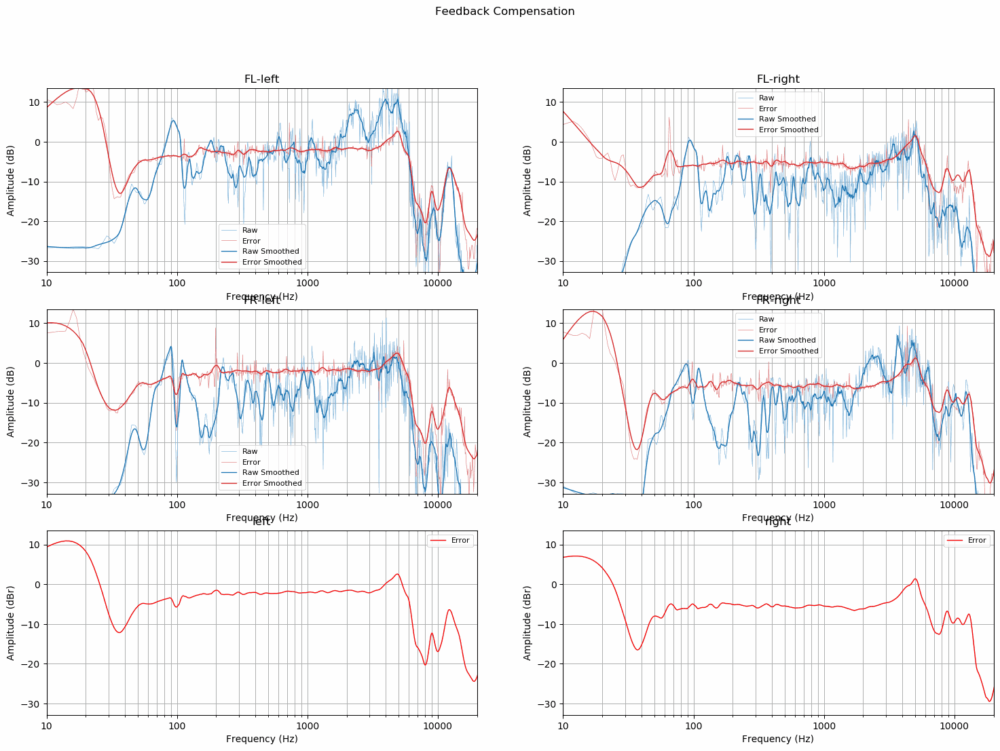
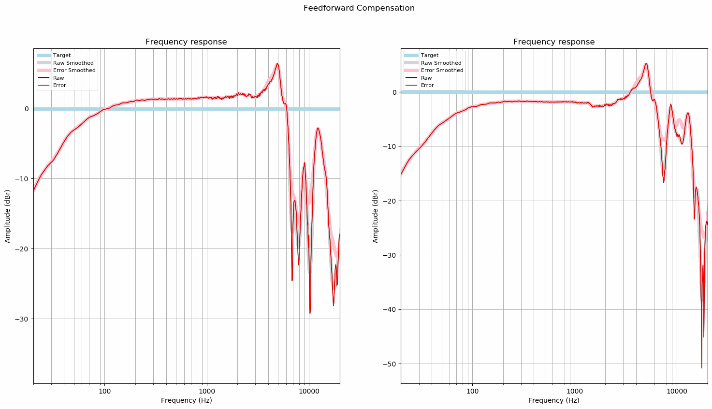
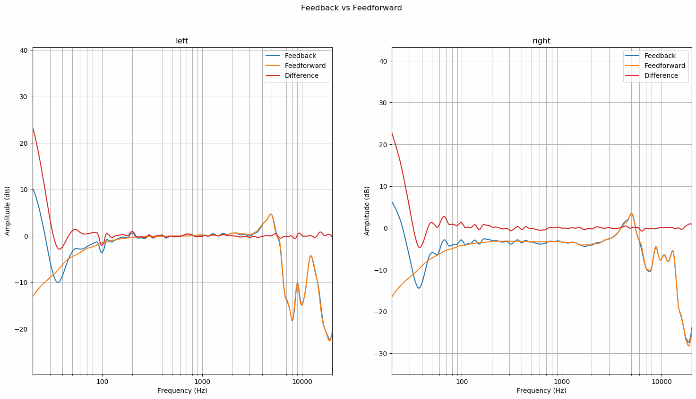

# Headphone Feedback Compensation

Select speaker output device as the default one and run
```bash
python recorder.py --play="research/headphone-feedback-compensation/sweep-seg-FL,FR-stereo-6.15s-48000Hz-32bit-2.93Hz-24000Hz.wav" --record="research/headphone-feedback-compensation/FL,FR.wav"
```

Generate sweep sequence virtualized with measured HRIR for headphone feedback compensation
```bash
python research/headphone-feedback-compensation/generate_headphone_sweep_sequence.py
```

Measure headphone feedforward compensation for comparison
```bash
python recorder.py --play="data/sweep-seg-FL,FR-stereo-6.15s-48000Hz-32bit-2.93Hz-24000Hz.wav" --record="research/headphone-feedback-compensation/headphones.wav"
```

Measure headphone feedback compensation using the generated virtualized sweep sequence
```bash
python recorder.py --play="research\headphone-feedback-compensation\headphones-sweep-seq-FL,FR-stereo-6.15s-48000Hz-32bit-2.93Hz-24000Hz.wav" --record="research/headphone-feedback-compensation/headphones-FL,FR.wav"
```

Compare feedforward and feedback compensation curves
```bash
python research/headphone-feedback-compensation/compare_headphone_compensation_methods.py
```

## Results
Feedback and feed-forward compensated heapdhone frequency response errors are remarkably similar. Only significant
difference can be found in the sub 30 Hz region where the feedback measurement has up to 10 dB more bass.

Level of the right side measurements in both cases are about 3 dB lower than left side. This contradicts the findings of
mic calibration research which shows the level difference of the two binaural microphones to be only 1 dB. Of course
it's possible that the level difference is due to headphones but that seems unlikely option since Sennheiser HD 800 have
very well pair matched drivers.

More research is needed to find out the reason for the level difference.

#### Feedback Compensation
These errors are the difference between frequency response of the HRIR measurement and the frequency response of the
headphone compensation measurement done by virtualizing sine sweep sequence with the measured HRIR.


#### Feed-forward Compensation
These are frequency responses and their differences from flat target. Raw sine sweep sequences were played back on
headphones.


#### Comparison
These are comparisons between feedback and feed-forward compensation methods.

