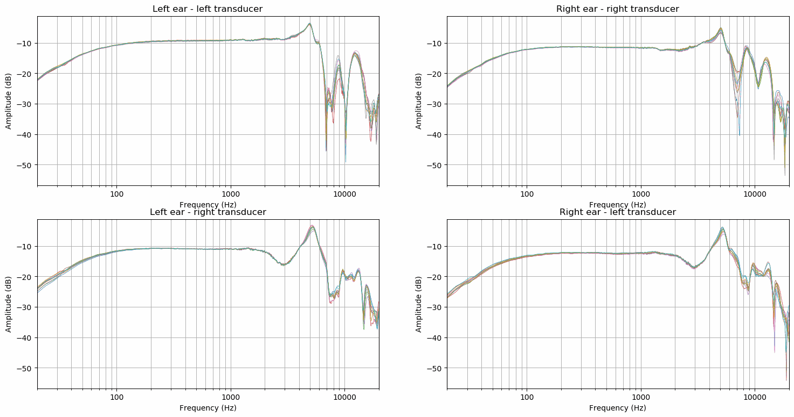

# Headphone Reseat Repeatability
Multiple measurements of headphone compensation were made to inspect frequency response repeatability when headphones
are taken off and put back on. Two sets of measurements were made: "normal" and "reversed". Normal measurements have
headphones in normal, most comfortable, position of the test subject. Reversed measurements have headphones flipped so
that left side transducer is next to right ear and vise versa. Reversed measurements were added to investigate whether
the left-right asymmetry is caused by the microphone capsules or the headphones.

When the headphones are placed in their most comfortable position the frequency response repeatability is very good with
bigger variation in the 7 to 8 kHz region and above 15 kHz. Left-right asymmetry is not caused by the microphone
capsules as is shown in mic-calibration experiment. The used capsules have both very similar frequency responses.
Microphone placement could explain the difference however by visual inspection the two capsules were inserted very
similarly.

Headphones used in this experiment were Sennheiser HD 800 and the binaural microphones were The Sound Professionals
SP-TFB-2 with hooks cut off and the capsules glued to ear plugs.

