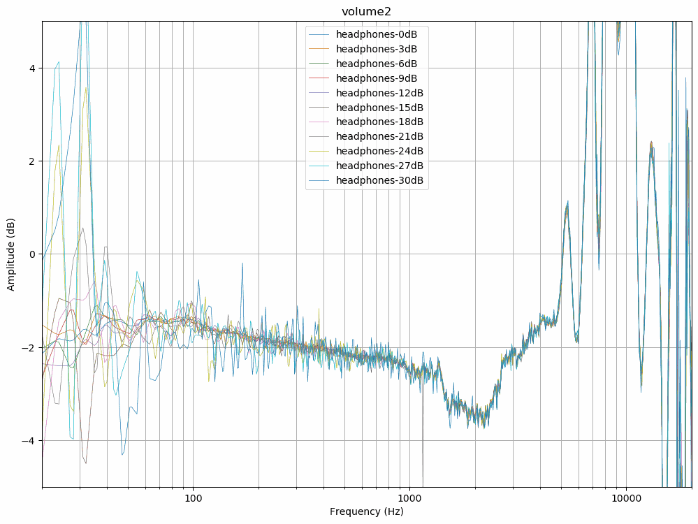
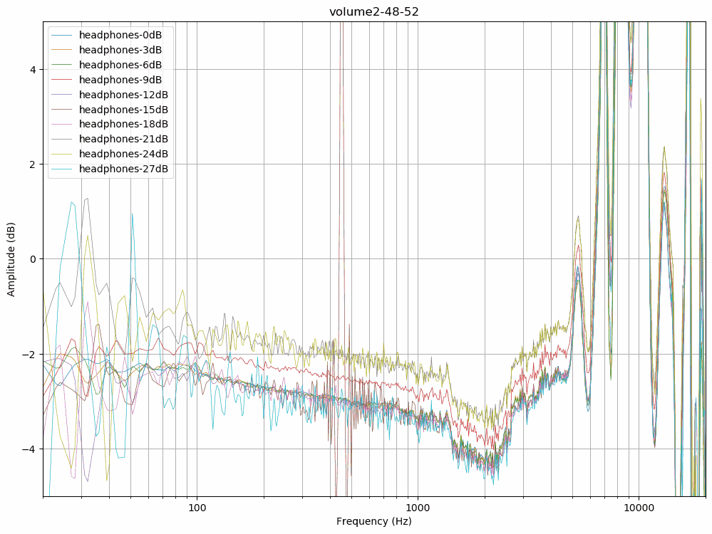
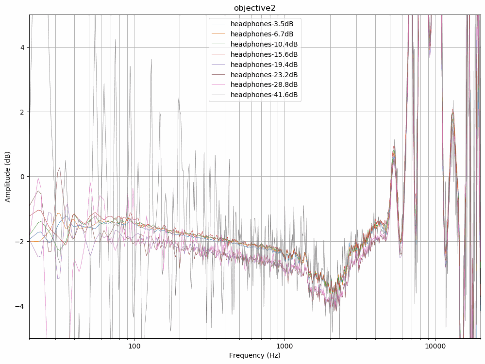
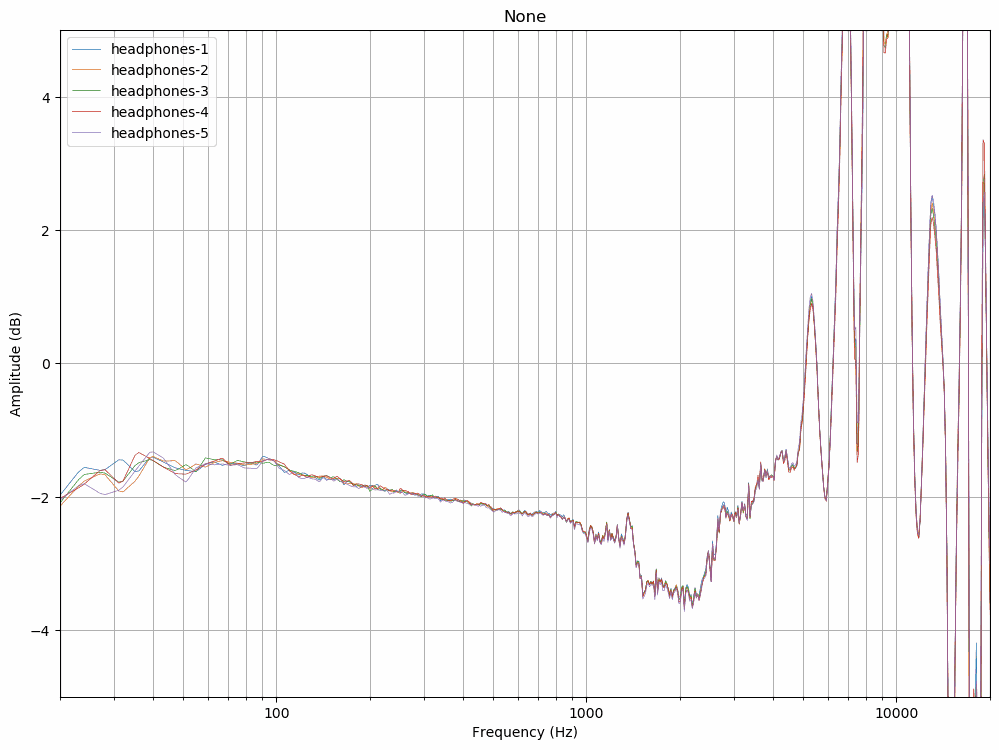

# Level VS Balance
This experiment investigates if level adjustment affects channel balance.

I noticed that controlling volume digitally with volume2 changes channel balance, at least perceptually. This should not
be possible but there is a possibility of a bug or glitch in the EqualizerAPO-Volume2-VirtualCable pipeline I'm using
for binaural rendering with HRIRs.

Headphone compensation measurements were made with multiple different volume levels and channel balance of each of them
are inspected to find out if the channel levels are adjusted equally when controlling level. 

**volume2** folder contains measurements where volume has been adjusted with volume2. Channel balance stays roughly the
same throughout the frequency spectrum except for a few measurements in the sub-bass region.

**volume2-48-52** folder contains measurements done with volume2 but so that channel balance in volume2 options is
48/52. This shows that volume2 doesn't retain the same channel balance when adjusting volume.

**objective2** folder contains measurements where volume has been adjusted with the analog volume adjustment of
Objective2 headphone amplifier. Operating system volume was at 0 dB. There are two groups where the first four with
headrooms between -3.5 dB and -15.6 dB are close to each other and the last four with head rooms between 19.4 dB and
41.6 dB are somewhat close to each other although the last measurement has a large variance.

**none** folder contains measurements where volume has not been adjusted and has been at 0 dB for all measurements. This
is the baseline which shows the general repeatability of the measurement setup. Channel balance stays very similar
throughout all measurements.

