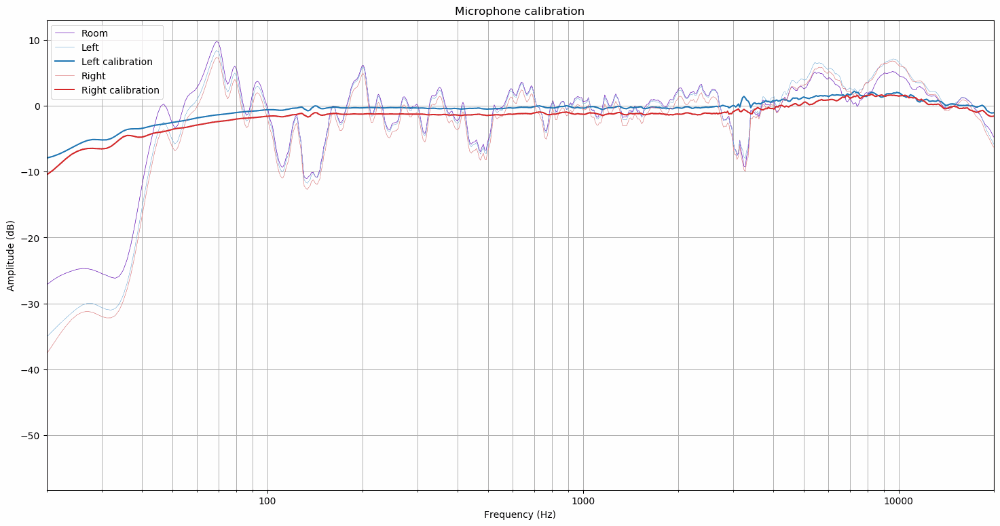

# Microphone Calibration
Herein lies a tool to calibrate binaural microphones against calibrated measurement microphone such as MiniDSP UMIK-1.

Microphone calibration tool reads exponential sine sweep recordings made with the binaural mics and measurement mic in
the same physical location. Multiple measurements of both can be done and these will be averaged.


Binaural mic recording files need to have file names `binaural-N.wav` where `N` can be a running number and measurement
mic recording files need to have file names `room-N.wav`. Recordings can be made with `recorder.py` tool.

Calibration file for the measurement microphone needs to be in file called `room-mic-calibration.txt` or
`room-mic-calibration.csv`. This is optional if the measurment microphone frequency response is naturally flat.

Calibration tool is ran:
```bash
python mic_calibration.py --test_signal="../../data/sweep-6.15s-48000Hz-32bit-2.93Hz-24000Hz.pkl"
```
This assumes the current working directory is `mic-calibration` and the recordings were made using the standard sweep
sequences found in `data` directory.

Microphone calibration tool produces a graph which shows frequency responses of left mic, right mic and the measurement
mic. Left mic and measurement mic frequency responses are centered so that they are around 0 dB. Right mic frequency
response is relative to left mic in order to reveal potential level matching problems of the two capsules.


