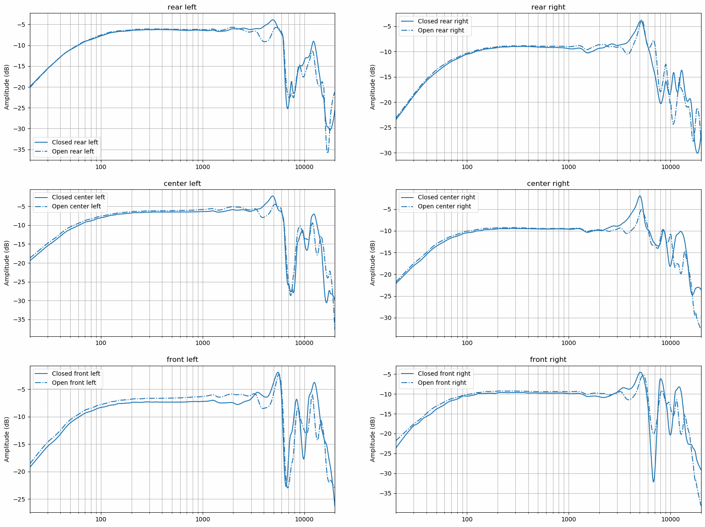

# Open vs Closed Ear Canal
Several headphone compensation measurements are inspected for the effects of closed vs open ear canal to the measured
frequency response. Measurements were done with headphones in three different locations: center, pushed towards the
front of the head and pushed towards back of the head. All measurments were repeated with ear canal open, ear canal
blocked with foam ear plugs and microphone capsules attached to the ear plugs (plugged).

Headphones used were Sennheiser HD 800 and microphones were The Sound Professionals SP-TFB-2. These microphones have a
silicone hook for keeping the capsule in place during recording and normally keep the ear canal open.

Results show a small dip at 4 kHz when the ear canal is open but not when it's closed. In some cases closed ear canal
measurements better capture the 5-6 kHz peak of Sennheiser HD 800. However it's unclear how much of these are caused by
the ear canal openness and how much is due to the mic placement. Mics were placed carefully at the same location at the
ear canal opening but still small differences in placement can have significant variation in the measured frequency
response.

Plugged measurements show level reduction by 3 to 4 dB and in some cases have significant dampening in 8 to 10 kHz
region. Other than that they are quite similar to the closed ear canal measurements and don't exhibit the 4 kHz notch
of open ear canal measurements.

