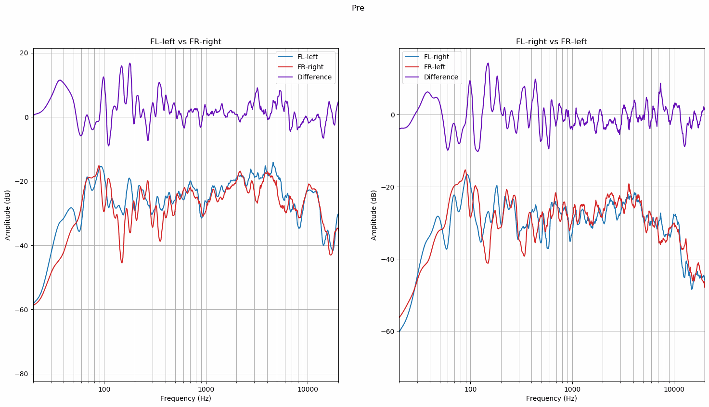
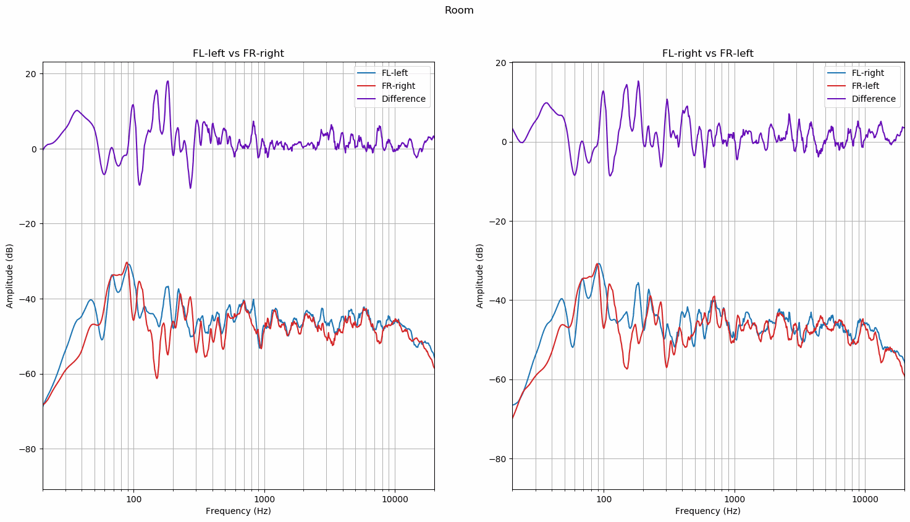
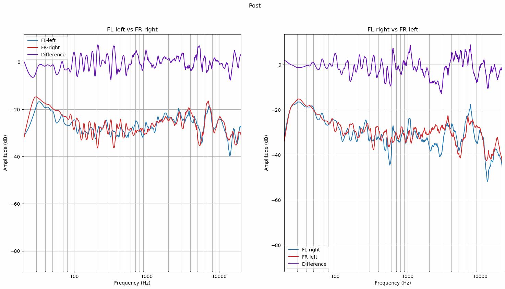

# Speaker Balance Graphs
Here lies a script to plot and inspect FL and FR speaker frequency responses compared to each other. This can be useful
for finding out possible issues with speaker channel balance.

You can replace `responses.wav`, `hrir.wav` and `room.wav` with files from your own recording session to inspect them.
Room graphs won't be produced if `room.wav` doesn't exist. Below you'll find example outputs.

#### Pre
Pre graphs represent the unprocessed binaural responses.

#### Room
Room graphs represent the room measurements done with measurement microphone.

#### Post
Post graphs represent the final output.

